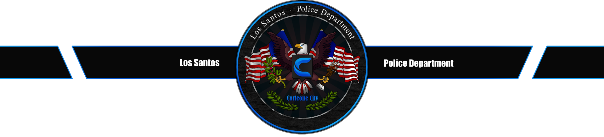

# LSPD Dashboard - Corleone City

Ein modernes Dashboard für das Los Santos Police Department der Corleone City. Bietet zentralen Zugriff auf alle wichtigen Polizei-Systeme und Tools.



## Features

Das Dashboard bietet schnellen Zugriff auf folgende Systeme:

- **Aktensystem** - Verwaltung von Bürger- und Fahrzeugakten
- **Personalsystem** - Mitarbeiterverwaltung und Beförderungen
- **Leitstelle** - Einsatzkoordination und Funkkommunikation
- **Diensthandbuch** - Richtlinien und Vorschriften
- **Generatoren** - Erstellung von Akten, Einsatzberichten und Razzien
- **Straftatenrechner** - Berechnung von Strafen und Hafteinheiten

## Design

- Modernes, responsives Design mit Glasmorphismus-Effekten
- Dunkles Theme optimiert für lange Arbeitszeiten
- Animierte Karten mit Hover-Effekten
- Vollständig responsive für Desktop, Tablet und Mobile
- Individuell farbcodierte Bereiche für bessere Übersicht

## Installation

### Mit Docker (empfohlen)

```bash
# Repository klonen
git clone https://github.com/Mas0n1x/lspd-dashboard.git
cd lspd-dashboard

# Docker Image bauen
docker build -t lspd-dashboard .

# Container starten
docker run -d -p 80:80 lspd-dashboard
```

Das Dashboard ist dann unter `http://localhost` erreichbar.

### Ohne Docker

Einfach die Dateien auf einen Webserver hochladen oder lokal öffnen:

```bash
# Repository klonen
git clone https://github.com/Mas0n1x/lspd-dashboard.git
cd lspd-dashboard

# index.html im Browser öffnen
```

## Technologie-Stack

- **Frontend**: HTML5, CSS3, Vanilla JavaScript
- **Icons**: Font Awesome 6.4.0
- **Deployment**: Nginx (via Docker)
- **Container**: Docker mit Alpine Linux

## Anpassung

Die Dashboard-Links können in der [index.html](index.html) angepasst werden. Jede Karte ist ein `<a>`-Element mit eigenen Farben und Icons:

```html
<a href="DEINE_URL" class="dashboard-card card-NAME" target="_blank">
    <div class="card-icon">
        <i class="fas fa-ICON"></i>
    </div>
    <h3 class="card-title">Titel</h3>
    <p class="card-description">Beschreibung</p>
</a>
```

## Projekt-Struktur

```
lspd-dashboard/
├── index.html          # Haupt-HTML-Datei
├── Dockerfile          # Docker-Konfiguration
├── logo.png           # LSPD Logo
├── header.png         # Header-Bild
├── background.jpg     # Hintergrundbild
└── README.md          # Diese Datei
```

## Browser-Kompatibilität

- Chrome/Edge (empfohlen)
- Firefox
- Safari
- Opera

## Lizenz

Erstellt für Corleone City LSPD

---

**"Obey and Survive"**

Mit ❤️ gemacht von Tommy
